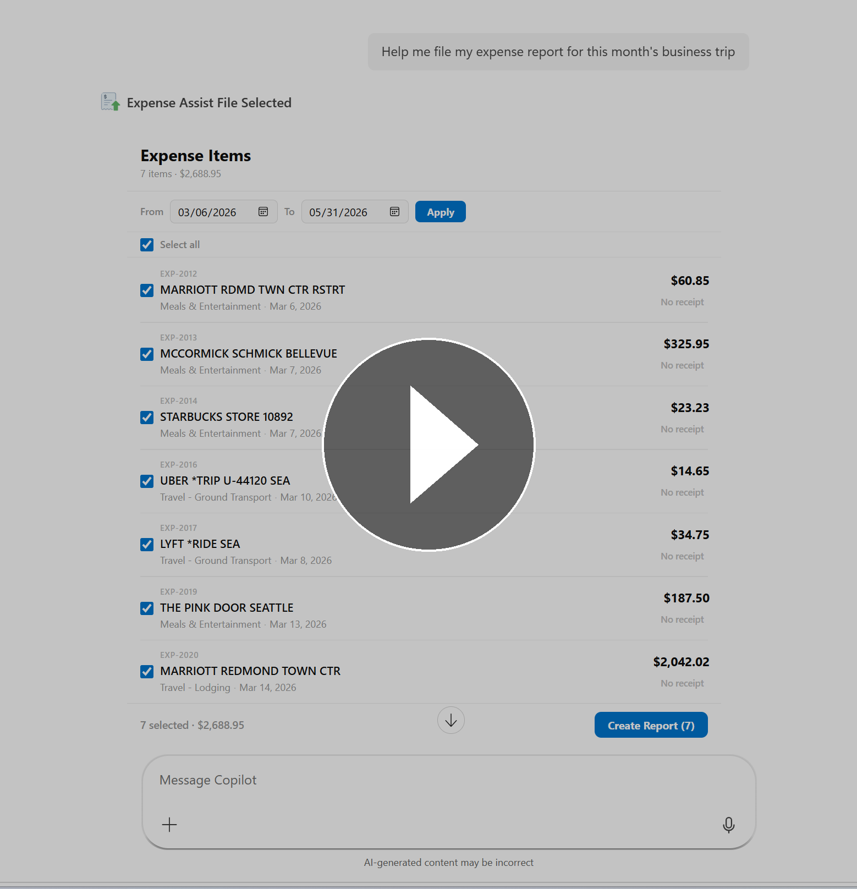
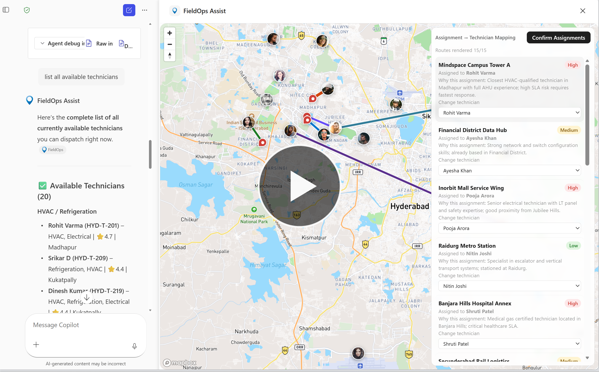
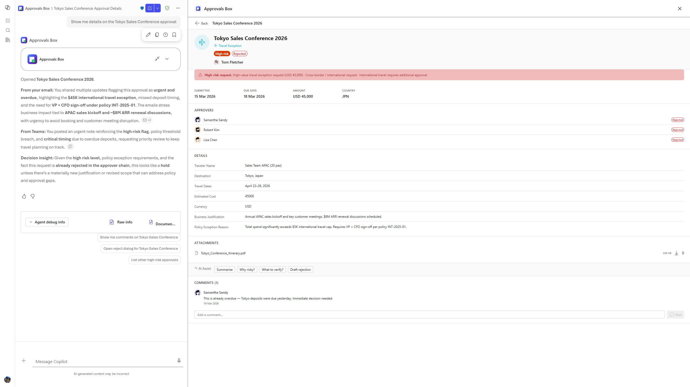
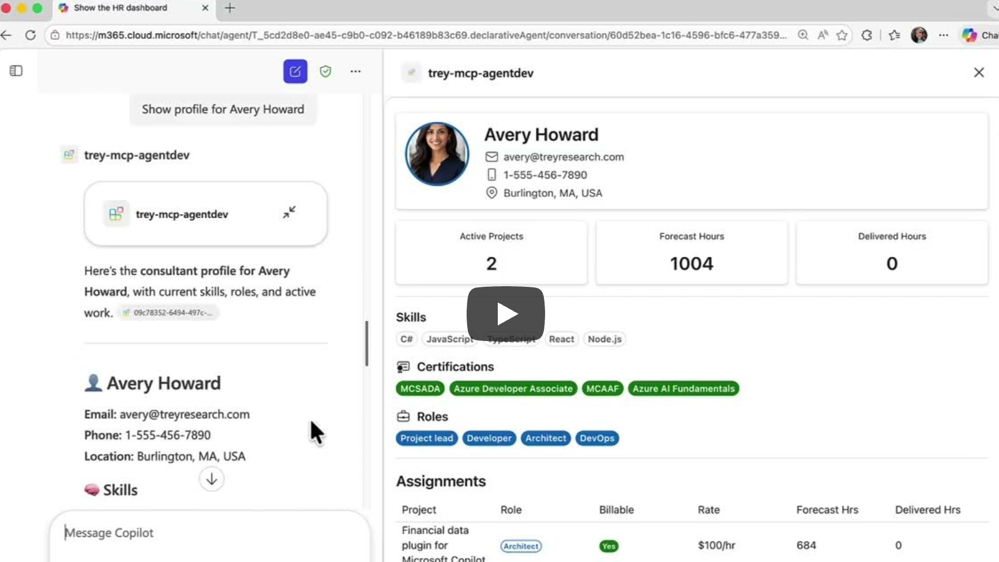
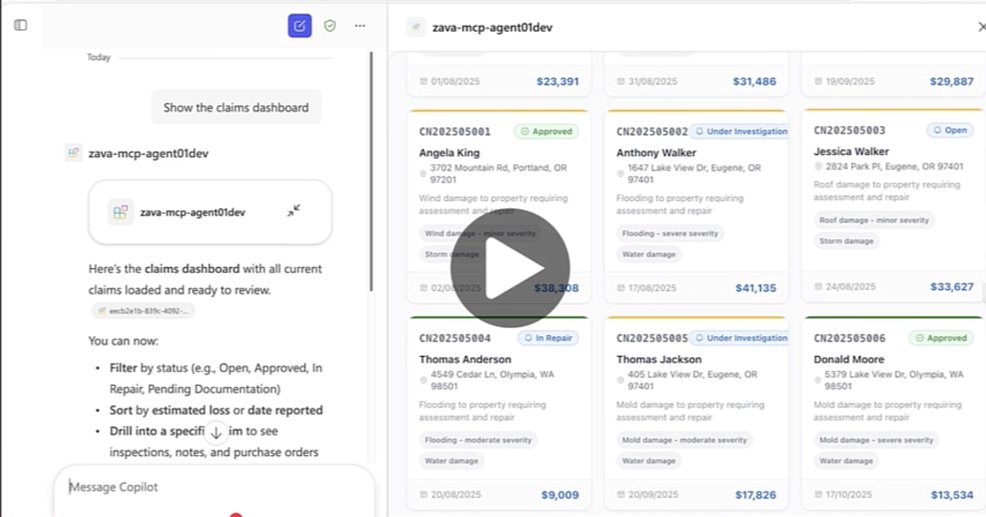
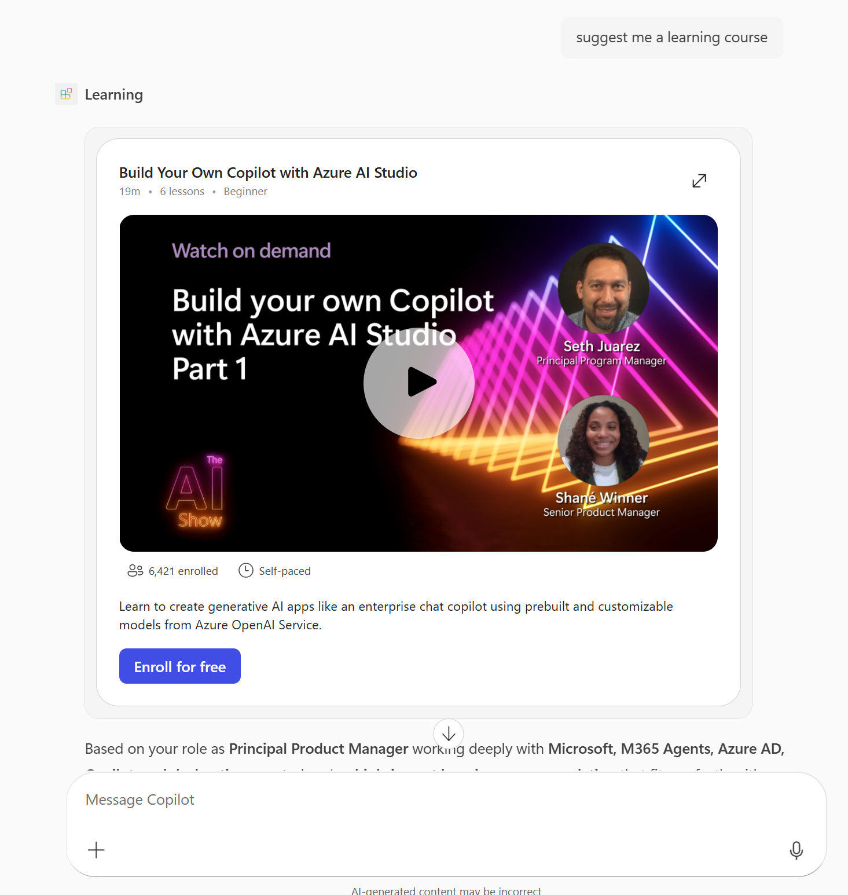

# MCP based interactive UI samples for Microsoft 365 Copilot

This repository contains sample MCP servers with rich interactive UI widgets that render inside Microsoft 365 Copilot. Use these samples to learn how to build declarative agents with visually rich tool responses.

## Interactive UI in Copilot

You can add interactive UI widgets to your declarative agents by adding a Model Context Protocol (MCP) server-based action to your agent and extending the MCP tools used by the agent to include UI. Microsoft 365 Copilot supports UI widgets created using the following methods:

- **[MCP Apps](https://modelcontextprotocol.github.io/ext-apps/api/documents/Overview.html)** — An extension to MCP that enables MCP servers to deliver interactive user interfaces to hosts.
- **[OpenAI Apps SDK](https://developers.openai.com/apps-sdk)** — Tools to build ChatGPT apps based on the MCP Apps standard with extra ChatGPT functionality.


## Samples

### Expense Submission — AI-powered Document & File Workflows

MCP server for expense report filing with file handling, Entra SSO with On-Behalf-Of (OBO) flow, and Microsoft Graph API integration. Demonstrates receipt matching from email, OneDrive/SharePoint, and local folders with interactive widgets for expense management.

- [MCP Apps version](mcp-apps/expense-submission/node/README.md)
- Watch demo on YouTube: https://www.youtube.com/watch?v=Jh7w13q-a6I&t=3s

[](https://www.youtube.com/watch?v=Jh7w13q-a6I&t=3s)

| Prompt | What it does |
|---|---|
| Help me file my expense report for this month's business trip. | Lists expense items, lets you select them, creates a draft, auto-matches email receipts, and guides you through submission. |
| *(Upload receipts in Copilot chat)* | The agent automatically matches uploaded receipts with your system of record data (in this example, dummy corporate card transactions). |

---

### Field Service Dispatch

MCP server for a field service dispatch workflow with assignment intake, map visualization, dispatch planning, and confirmation flow. Requires a free Mapbox token for map widgets.

- [MCP Apps version](mcp-apps/fieldops/node/src/mcpserver/README.md)
- [OpenAI Apps SDK version](oai-apps-sdk/fieldops/node/README.md)

[](https://www.youtube.com/watch?v=rsfPzTxCgjQ)

| Prompt | What it does |
|---|---|
| Show me new assignments from the last 24 hours. | Lists intake items in a list widget. |
| Show these assignments on the map. | Renders assignments on an interactive map. |
| Create a dispatch plan for these assignments. | Shows a dispatch planning UI with technician assignments. |

---

### Approvals Box — AI-powered Approval Queue Management

MCP server for approval queue management with risk triage, bulk decisions, and inline widgets for reviewing, approving, rejecting, and creating approval requests. Auto-seeded with ~50 realistic demo approvals across 7 types.

- [OpenAI Apps SDK version](oai-apps-sdk/approvals-box/node/README.md)

<a href="https://youtu.be/Zre_6fFKBXg" target="_blank"></a>



| Prompt | What it does |
|---|---|
| Show me my pending approvals. | Opens the list widget with all pending approvals, sorted by due date. |
| Which approvals are high risk? | Filters the list to high-risk items and opens the widget. |
| Show me the details for the Activision InComm approval. | Resolves the approval by name and opens the detail widget. |
| Approve the pending purchase order from Kevin Walsh. | Opens the detail widget with the approve dialog pre-opened. |
| Bulk reject all low-priority travel exceptions. | Opens the list filtered to travel exceptions with the bulk-reject dialog. |
| Draft a rejection reason for the capex request. | AI drafts a rejection note; confirm to reject. |

---

### Trey Research — HR Consultant Management

MCP server for managing HR consultants, projects, and assignments with Fluent UI React widgets including an HR dashboard, consultant profile cards, bulk editor, and project detail views.

- [Declarative Agent connected to MCP server (MCP Apps)](mcp-apps/trey-research/node/README.md)
- [Declarative Agent connected to MCP server (OpenAI Apps SDK)](oai-apps-sdk/trey-research/node/README.md)
- [MCP Server using MCP Apps](mcp-apps/trey-research/node/src/mcpserver/README.md)
- [MCP Server using OpenAI Apps SDK](oai-apps-sdk/trey-research/node/src/mcpserver/README.md)

<a href="https://www.youtube.com/watch?v=kNXT7Syf9fQ" target="_blank"></a>

| Prompt | What it does |
|---|---|
| Show the HR dashboard. | Opens the HR consultant dashboard widget. |
| I need a React developer for the Copilot project at Consolidated Messenger. Find someone with React skills, show me their profile, and assign them as a Developer. | Searches consultants by skill, displays a profile card, and assigns the consultant to a project — all by name, no IDs needed. |
| Show me the HR dashboard filtered to only billable assignments. Which consultants have the most forecasted hours, and are any of them over-allocated? | Opens the interactive dashboard with a billable filter applied, then the AI analyzes forecast data across consultants to surface workload insights. |
| We need to staff the Disaster Recovery project at Relecloud. Show me the project details, then find all consultants who have Python or Java skills and bulk-assign them as Developers at $120/hr. | Chains project lookup, skill-based consultant search, and bulk assignment in a single conversation — replacing multiple clicks across an HR system. |
| Compare Avery Howard and Sanjay Puranik — show me both their profiles side by side. Who has more certifications, and which projects are they currently assigned to? | Fetches two consultant profiles by name and synthesizes a comparison of certifications, skills, and active assignments. |

---

### Zava Insurance — Claims Management

MCP server for insurance claims management with claims dashboard, claim detail with map view, and contractor list widgets.

- [Declarative Agent connected to MCP server (MCP Apps)](mcp-apps/zava-insurance/node/README.md)
- [Declarative Agent connected to MCP server (OpenAI Apps SDK)](oai-apps-sdk/zava-insurance/node/README.md)
- [MCP Server using MCP Apps](mcp-apps/zava-insurance/node/src/mcpserver/README.md)
- [MCP Server using OpenAI Apps SDK](oai-apps-sdk/zava-insurance/node/src/mcpserver/README.md)

<a href="https://www.youtube.com/watch?v=1zrWTtuDaQk" target="_blank"></a>


| Prompt | What it does |
|---|---|
| Show the claims dashboard. | Opens the claims dashboard widget with all claims, status metrics, and click-to-detail. |
| Show me all open claims sorted by estimated loss from highest to lowest. | Opens the dashboard filtered to open claims and sorted by estimated loss descending — quickly surfaces the highest-value open claims. |
| Show me Kimberly King's claim details, and tell me what inspections are pending. | Fetches the claim detail widget for the specific policy holder and summarizes pending inspection status. |
| Show me the preferred roofing contractors. | Opens the contractors list filtered to preferred roofing specialists — useful when assigning repair work on storm or roof damage claims. |
| Approve claim 2 with a note that all documentation has been verified, then show me the updated dashboard. | Updates the claim status to Approved, adds a note, and re-opens the dashboard so you can confirm the change — a multi-step workflow in one prompt. |
| Create a high-priority initial inspection for claim CN202504990 scheduled for next Monday, and assign it to an inspector who specializes in fire damage. | Lists inspectors, picks one with fire damage specialization, and creates the inspection — chains three tools automatically. |
| Which claims have the highest estimated losses? Show me the top ones and compare their damage types. | Opens the dashboard sorted by estimated loss descending, then the AI analyzes damage types across high-value claims to surface patterns. |
| Show the claim detail for claim 1. Then approve the pending purchase order and mark the inspection as completed with findings noting that all repairs are satisfactory. | Chains claim detail view, purchase order approval, and inspection update in one conversation — replaces multiple manual steps. |

---

### Employee Training

MCP server that recommends learning and training courses with embedded video previews, inline entity cards, and fullscreen course views.

- [MCP Apps version](mcp-apps/employee-training/node/README.md)



| Prompt | What it does |
|---|---|
| Recommend a training course about AI agents. | Shows a course card with embedded video. |
| Show me a course on Semantic Kernel. | Renders the course widget with video player. |
| What training is available for Azure AI? | Returns a recommended course card. |

---

### Enterprise LOB MCP Apps

> **Pre-built M365 Copilot agents for enterprise LOB systems** — each with interactive React widgets, one-command deploy, and production-ready patterns.

<p align="center">
  
  
  
  <br/><br/>
  
  
  
  
  
  
</p>

Every major LOB platform exposes a different API paradigm — Salesforce uses SOQL, ServiceNow provides GlideRecord. Integrating even a single system into M365 Copilot requires dedicated engineering effort spanning OAuth, data model mapping, pagination, rate limits, and building a UI that makes results **actually useful** rather than dumping raw JSON into chat. These apps solve that.

Each app ships with:
- A **Python MCP server** with production patterns — caching, structured logging, telemetry, and error handling
- An **interactive React widget** on Fluent UI v9 that renders inline in Copilot chat
- A **one-command deploy path** to either a local dev tunnel or Azure Container Apps

| # | App | Tools | Landing page |
|---|---|---|---|
| 1 | 🏛️ **Ask - Salesforce** | 30 | [mcp-apps/salesforce-crm/python/](mcp-apps/salesforce-crm/python/README.md) |
| 2 | 🎫 **Ask - ServiceNow** | 31 | [mcp-apps/servicenow-itsm/python/](mcp-apps/servicenow-itsm/python/README.md) |
| 3 | 🟠 **Ask - HubSpot** | 19 | [mcp-apps/hubspot-crm/python/](mcp-apps/hubspot-crm/python/README.md) |

[](https://youtu.be/eELXlXAn2ac)

| Prompt | What it does |
|---|---|
| Show me the latest leads. | Lists recent Salesforce leads in a sortable table with inline edit/create. |
| Show qualification opportunities for Acme. | Filters opportunities by stage and account name. |
| Show me the sales pipeline dashboard. | Aggregates open opportunities by stage with a bar chart. |
| Show me open incidents. | Lists recent ServiceNow incidents with priority indicators. |
| Resolve INC0010001 as solved remotely. | Opens the resolve form with close-code picklist. |
| Search knowledge for VPN setup. | Searches published ServiceNow knowledge base articles. |
| Show me deals for Acme. | Lists HubSpot deals for a company with stage and amount, inline edit/create. |
| Create a task to follow up with Acme. | Opens a prefilled HubSpot activity form (task/call/note/meeting/email). |
| Show me contacts at Acme. | Lists HubSpot contacts associated with a company. |

## Repository structure

```
mcp-apps/                        # MCP Apps SDK samples
  employee-training/node/        # Learning course recommendations
  expense-submission/node/       # Expense filing with Entra SSO & file handling
  fieldops/node/                 # Field service dispatch
  hubspot-crm/python/            # Enterprise HubSpot CRM (19 tools)
  salesforce-crm/python/         # Enterprise Salesforce CRM (30 tools)
  servicenow-itsm/python/        # Enterprise ServiceNow ITSM + HR (31 tools)
  trey-research/node/            # HR consultant management
  zava-insurance/node/           # Insurance claims management

oai-apps-sdk/                    # OpenAI Apps SDK samples
  approvals-box/node/            # AI-powered approval queue management
  fieldops/node/                 # Field service dispatch
  trey-research/node/            # HR consultant management (declarative agent)
  zava-insurance/node/           # Insurance claims management (declarative agent)

M365-Agents-Toolkit-Instructions.md   # Step-by-step guide for building agents
agents-toolkit-screenshots/           # Screenshots for the instructions
```