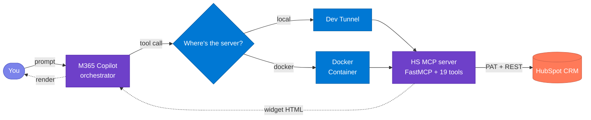

# Ask - HubSpot

**Ask - HubSpot** is a Model Context Protocol (MCP) App that connects a HubSpot CRM account to Microsoft 365 Copilot.

An MCP *server* exposes tools and data to an AI client over the open Model Context Protocol. An MCP *App* goes one step further: it returns an interactive user interface (a widget) alongside each tool response, so the client renders a live, interactive screen instead of plain text. **Ask - HubSpot** is that kind of app for HubSpot.

The flow is simple. A user types a request in plain English. Copilot calls the server. The server queries the HubSpot account and returns an interactive widget that renders inside the Copilot chat.

The server provides the following capabilities:

- The widgets render inline in the Copilot chat rather than in a separate browser tab.
- A user can read, create, and update records across five CRM entities — Companies, Contacts, Deals, Orders, and Products — plus five activity types (Notes, Calls, Tasks, Meetings, Emails).
- Each record opens a 360 view that drills into its associated records (contacts, deals, tickets, line items, companies) inside a modal.
- Lookup fields accept plain names instead of numeric HubSpot record IDs, and the agent resolves each name to the correct record when the form is saved.
- The server runs either on a local laptop or in a Docker container.
- Deployment is scripted. One command deploys the server locally.

<p align="center">
  
  
  
  
  
  
  
</p>

**Jump to:** [What this is](#1-what-this-is) · [How it works](#2-how-it-works) · [Install](#3-install) · [Troubleshooting](#4-troubleshooting)

---

## 1. What this is

**Ask - HubSpot** connects your HubSpot CRM to Microsoft 365 Copilot. When you type a request such as "show me companies" or "create a new company called Contoso", Copilot calls the MCP server, and the server returns an interactive widget that renders inside the chat, so you do not need to switch to a separate HubSpot tab. From the Copilot side panel you can read records, create new records, update existing records, and drill into a record's associated data.

**Name resolution:** Lookup fields accept plain names instead of numeric HubSpot record IDs. When you type "Acme Corp" into a Deal's Company field and save the record, the agent resolves that name to the correct company. If more than one record matches, the agent shows up to five suggestions so that you can select the correct one. The same behaviour applies to the Company field on Contacts, Deals, and Orders, the Contact field on Orders, and the Deal field on Orders. See [§2 → RESOLVE FK](#resolve-fk--type-names-not-ids) for the full flow.

> [!TIP]
> Works with any HubSpot account that has API access — Free, Starter, Professional, or Enterprise.

You can run the server in one of two ways:

- **Local.** Your laptop hosts the server, and a dev tunnel exposes it to Copilot over HTTPS. This option suits development, because you can change the code and test it quickly.
- **Docker.** The same server runs in a container. Because the container hosts the server rather than your laptop terminal, the agent stays available without your terminal open.



---

## 2. How it works

The app implements **19 tools** — a GET / CREATE / UPDATE trio for each of the six entity groups (Companies, Contacts, Deals, Orders, Products, Activities), plus a shared `hs__get_associations` tool that powers every record's drill-down. Most interactions map to one of eight operations. The table below is a quick reference, and each operation is then shown in action.

### 2.1 Canonical operations

These follow the standard three-tool pattern of GET, CREATE, and UPDATE, plus the drill-down, name-resolution, and clarify behaviours:

| # | Operation | What you say | What happens | Tips |
|---|---|---|---|---|
| 1 | **GET** | "show / get / find companies" | Lists the 10 most recent records | Just name the entity (companies, contacts, deals, orders, products, tasks); no filters needed |
| 2 | **FILTER** *(by field)* | "prospect companies" / "companies in London" | Narrows by a record field value | Type the value directly — type, stage, city, status, priority, or a numeric range; no name lookup needed |
| 2 | **FILTER** *(by parent — FK)* | "contacts for Acme" / "orders for Acme" | Narrows by the parent company, contact, or deal | Use the parent's **exact name**; if several match, pick from suggestions |
| 3 | **IDENTIFY** | "show company Evolt Active" | Fetches that specific record (or all matches if ambiguous) | Name the record and include the entity word so the agent routes to the right one |
| 4 | **EDIT** | "edit Evolt Active" | Opens the record with an edit form | Say "edit" + the record name, change fields in the form, then Save |
| 5 | **CREATE** | "create company Contoso, type PROSPECT, city Seattle" | Pre-filled form — complete and submit | Put known values **in the utterance** so the form pre-fills |
| 6 | **DRILL** | *(click the 👁 eye on a row)* | Opens a 360 modal with associated records | In full-screen view, click the eye to see contacts, deals, tickets, line items, and companies linked to the record |
| 7 | **RESOLVE FK** | *(type a name into 🔗 fields)* | Agent matches name → record on Save | In 🔗 fields type the **exact name**; if several match, pick from up to five suggestions |
| 8 | **CLARIFY** | *(agent asks you)* | Disambiguates before acting | If a name could be a company or a contact, answer the agent with the type |

### 2.2 What you can do with each record type

Not every record type supports every operation. The table below shows, in plain terms, what you can do with each one. There are no delete operations anywhere — records can be viewed, created, and updated, but never removed from the chat.

| Record type | View / find | Create | Edit / update | Drill-down (associations) |
|---|---|---|---|---|
| **Company** | ✓ | ✓ | ✓ | Contacts, Deals, Tickets |
| **Contact** | ✓ | ✓ | ✓ | Deals, Companies, Tickets |
| **Deal** | ✓ | ✓ | ✓ | Contacts, Companies, Tickets |
| **Order** | ✓ | ✓ | ✓ | Deals, Line Items, Companies |
| **Product** | ✓ | ✓ | ✓ | — |
| **Activity** (Note / Call / Task / Meeting / Email) | ✓ | ✓ | ✓ | Attaches to Company, Contact, or Deal |
| **Ticket** | ✓ (drill-down only) | — | — | Surfaced as an association on Companies, Contacts, and Deals |

> [!NOTE]
> Tickets are **view-only**: they appear inside the 360 modal of Companies, Contacts, and Deals via `hs__get_associations`. There is no standalone Ticket create/edit tool.

Most requests follow one simple pattern:

```
<verb> <entity> [where / with <condition>]
```

Where:

- **verb** is one of get, list, show, create, or edit.
- **entity** is the record type: company, contact, deal, order, product, or an activity (note, call, task, meeting, email).
- **condition** is an optional filter, such as type PROSPECT, city London, status fulfilled, or total over 5000.

Examples:

```
get companies where type = PROSPECT
list contacts for Acme
edit deal Global Fizz
show orders over 5000
create company Contoso, type PROSPECT, city Seattle
log a note for contact Maria
```

### 2.3 Fields, filters, and picklists

Each entity exposes a set of filterable fields and picklist-constrained form fields. Fields marked 🔗 accept plain names and are resolved to record IDs on Save.

**Companies** — filters: name, domain, type, lifecycle stage, city, country.
- **Type:** `PROSPECT`, `PARTNER`, `RESELLER`, `VENDOR`, `OTHER`
- **Lifecycle Stage:** `subscriber`, `lead`, `marketingqualifiedlead`, `salesqualifiedlead`, `opportunity`, `customer`, `evangelist`, `other`

**Contacts** — filters: first name, last name, email, job title, city, lifecycle stage, company (🔗).

**Deals** — filters: deal name, stage, pipeline, deal type, company (🔗).
- **Stage:** Lead Captured, Qualified, Proposal Sent, Negotiation, Closed Won, Closed Lost
- **Deal Type:** `newbusiness`, `existingbusiness`

**Orders** — filters: order name, fulfillment status, payment status, currency, total range (`hs_total_price_min` / `hs_total_price_max`), company (🔗), contact (🔗), deal (🔗).
- **Fulfillment:** `pending`, `fulfilled`, `shipped`, `canceled`
- **Payment:** `pending`, `paid`, `refunded`, `failed`
- **Currency:** `USD`, `EUR`, `GBP`, `CAD`, `AUD`, `INR`

**Products** — filters: name, status, product type.
- **Status:** `active`, `inactive`
- **Product Type:** `inventory`, `non_inventory`, `service`

**Activities** — filtered by type (note, call, task, meeting, email) and optionally by parent company/contact/deal (🔗). Tasks filter by status and priority; calls, meetings, and emails filter by their outcome/direction/status picklists.

### 2.4 In action

#### GET — list recent records

Ask for any entity by name. The agent returns the most recent records as a sortable table with ✏️ Edit / ➕ New controls per row.

#### FILTER — narrow the list

Add conditions to your request — *"prospect companies"*, *"orders over 5000"*, *"contacts for Acme"*. The agent maps your natural language to the correct HubSpot filter operators (`CONTAINS_TOKEN` for text, `EQ` for picklists, `GTE`/`LTE` for numeric ranges). Foreign-key filters like *"orders for Acme"* traverse HubSpot associations server-side.

#### IDENTIFY — show a specific record

Mention a name and the entity word. If it matches multiple records, the agent surfaces all matches. If it resolves to one, it shows that single record.

#### EDIT — modify a record

Say *"edit"* followed by a name. If one match, the edit form opens directly with the fields pre-filled. If multiple match, the list is shown so you can pick the right one. Date fields (deal close date, order close date, task due date) open a date picker.

#### CREATE — open a pre-filled form

The agent picks out values from your sentence — name, type, company — and pre-fills the create form. You review, complete any remaining fields, and submit. The form's Save button performs the write.

#### DRILL — open the 360 modal

In the full-screen widget, each row shows a 👁 eye icon. Click it to open a 360 modal that lists the record's associated data inline — for example, a Deal shows its Contacts, Companies, and Tickets; an Order shows its Deals, Line Items, and Companies.

#### RESOLVE FK — type names, not IDs

Fields marked with 🔗 accept plain names. Type a name, hit Save — the agent resolves it to the HubSpot record ID. If there's no exact match, you get up to five suggestions to pick from.

> [!TIP]
> Look for the 🔗 icon on form fields — those are the ones that accept names instead of IDs.

#### CLARIFY — agent asks when ambiguous

If a name could apply to more than one entity type, the agent asks first.

*"get orders for Maria Johnson"* → Agent: *"Is Maria Johnson a company (account) or a contact?"*

---

## 3. Install

The installation has four steps: get the app folder, configure your credentials, run the server locally, and optionally run it in Docker. The whole process takes about 15 minutes.

### Step 1 — Get the app folder

Use **either** option, then `cd` into the app folder.

**Option A — Clone the repo:**
```powershell
git clone https://github.com/microsoft/mcp-interactiveUI-samples.git
cd mcp-interactiveUI-samples/mcp-apps/hubspot-crm/python
```

**Option B — Extract the distributed zip:** unzip the app package, then open a terminal in the extracted folder (it already contains everything below — no clone needed).

**Validate:** You should see `hs_crm_mcp/`, `shared_mcp/`, `widgets/`, `deploy/`, and `agent/` directories.

---

### Step 2 — Get your HubSpot credentials

You need a **Private App Token** from your HubSpot account.

1. Go to **Settings → Integrations → Private Apps** in HubSpot.
2. Click **Create a private app**.
3. Give it a name (e.g. "M365 Copilot MCP").
4. Under **Scopes**, add read and write for every object the app touches:
   - `crm.objects.companies.read`, `crm.objects.companies.write`
   - `crm.objects.contacts.read`, `crm.objects.contacts.write`
   - `crm.objects.deals.read`, `crm.objects.deals.write`
   - `crm.objects.line_items.read`, `crm.objects.line_items.write`
   - `crm.objects.orders.read`, `crm.objects.orders.write` (Commerce)
   - `e-commerce` (Products)
   - `tickets` (read — for ticket drill-downs)
   - `crm.objects.owners.read`
   - Engagements (notes, calls, tasks, meetings, emails) are covered by the CRM object scopes above.
5. Click **Create app** and copy the token.

> [!IMPORTANT]
> The token starts with `pat-na2-...` (or similar depending on your region). Keep it safe — it grants API access to your CRM data.

> [!TIP]
> If a request returns empty results, the most common cause is a missing scope for that object. Add the object's `.read`/`.write` scope and regenerate the token.

**Validate:** You have your Private App Token copied.

---

### Step 3 — Run locally

**Prerequisites** (install these first — the script stops immediately if any are missing):

- 🐍 **Python ≥ 3.11**
- 📦 **Node.js ≥ 18** (for widget build)
- 🌐 **[Dev Tunnels CLI](https://learn.microsoft.com/azure/developer/dev-tunnels/get-started)** — run `devtunnel user login` once
- 🛠️ **[M365 Agents Toolkit](https://aka.ms/teamsfx)** (VS Code extension)
- 🏢 **M365 dev tenant** with **Custom App Upload Enabled ✓** and **Copilot Access Enabled ✓**

**Action:** Copy `.env.example` to `.env` in the project root, then fill in your token:

| Param | Value |
|---|---|
| `HUBSPOT_ACCESS_TOKEN` | Your Private App Token (e.g. `pat-na2-...`) |
| `PORT` | *(optional)* Server port, default `8082` |
| `APPINSIGHTS_CONNECTION_STRING` | *(optional)* App Insights connection string for telemetry |

Then run:
```powershell
.\deploy\LocalDeploy.ps1
```

The script takes 3–4 minutes the first time:
1. 🐍 Python venv + dependencies (~60s)
2. ⚛️ React widget bundle (~45s)
3. 🚀 MCP server on `:8082` (~3s)
4. 🌐 Dev tunnel with public HTTPS URL (~5s)
5. 📤 Agent package uploads to M365 (~15s, device-code sign-in first time)

**Validate:**
1. The terminal shows the LIVE banner:
```text
  =====================================
   ASK - HUBSPOT CRM COPILOT LIVE
  =====================================
  Server  -->  http://localhost:8082
  Tunnel  -->  https://<id>-8082.inc1.devtunnels.ms
  MOS3    -->  agent package live in M365 Copilot
```
2. Test the server:
```powershell
curl -X POST http://localhost:8082/mcp -H "Content-Type: application/json" -d '{"jsonrpc":"2.0","method":"initialize","id":1}'
```
You should get a JSON-RPC response.
3. Open M365 Copilot → pick **Ask - HubSpot** from the agent picker.
4. Wait ~30–60 s for the agent to register; refresh if it doesn't appear.
5. Try *"show me companies"* — a widget should render with a company list.

> [!TIP]
> If the agent doesn't appear in the picker, wait 1–2 minutes and refresh. Still missing? Jump to [§4 Troubleshooting](#4-troubleshooting).

---

### Step 4 — Run with Docker (optional)

This step hosts the MCP server in a container instead of your terminal. The container keeps the server running without your terminal open.

```powershell
cd mcp-apps/hubspot-crm/python
docker build -t hs-mcp-copilot .
docker run -p 8082:8082 -e HUBSPOT_ACCESS_TOKEN=pat-na2-... hs-mcp-copilot
```

---

## 4. Troubleshooting

### Agent & Copilot

- **Agent missing from the picker** — Wait 1–2 minutes after upload, then refresh. Check that Custom App Upload is enabled in M365 admin.
- **"Oops! Something went wrong"** — Dev tunnel dropped momentarily. Wait 5–10 seconds and re-send.
- **Widget doesn't render** — Confirm the server is running and responding at `/mcp`.

### HubSpot connection

- **`401 Unauthorized`** — Token is invalid or expired. Regenerate in HubSpot Settings → Private Apps.
- **Empty results for one entity** — Your Private App is likely missing that object's CRM scope. Add the matching `.read`/`.write` scope (see Step 2) and regenerate the token.
- **`HTTP 400 — One or more associations are invalid`** — The record you are linking to does not exist or is not associable with the source object. Confirm the parent (company, contact, or deal) exists and is spelled exactly.

### MCP server

- **`/mcp` returns 421 "Invalid Host header"** — DNS rebinding protection. Already disabled in this codebase via `enable_dns_rebinding_protection=False`.
- **Unicode errors on Windows** — Set `PYTHONIOENCODING=utf-8` before running the server.
- **Port in use** — Another process is on 8082. Kill it or change `PORT` in `.env`.

### Common questions

- **Can I run without Docker?** — Yes. Fill `.env`, run `LocalDeploy.ps1`. Dev tunnel handles the rest.
- **Which entities are supported?** — Companies, Contacts, Deals, Orders, and Products (full read / create / update), plus Activities (Notes, Calls, Tasks, Meetings, Emails). Tickets are read-only via drill-down.
- **How do I add a new entity?** — Add a `get`/`create`/`update` trio to `hs_crm_mcp/hubspot_tools.py`, add the entity schema to `_ENTITY_SCHEMAS`, register the tools with the server, add a widget view under `widgets/src/hubspot/views/`, and re-run deploy.
- **Is this production-ready?** — It's a reference implementation for demos and pilots. For production: move secrets to Key Vault, add audit logging and rate limiting, and review the HubSpot scopes granted to the Private App.
