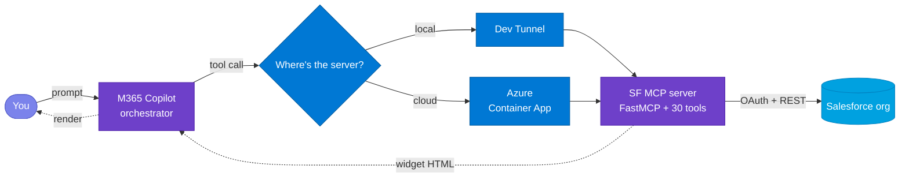

# Ask - Salesforce

> Drop your Salesforce org into Microsoft 365 Copilot. Ask questions in plain English, get back live interactive widgets right inside the chat.

- 🪟 Live widgets render inline in chat
- ✏️ Read / create / update across 7 CRM entities, plus pipeline dashboard and approvals
- 🔗 Type names, not Ids — agent resolves them on save
- 💻 Local laptop or ☁️ Azure Container Apps
- ⚡ One-command deploy

       

**Jump to:** [What this is](#1-what-this-is) · [How it works](#2-how-it-works) · [Install](#3-install) · [Troubleshooting](#4-troubleshooting)

---

## 1. What this is

**Ask - Salesforce** brings your Salesforce org straight into Microsoft 365 Copilot. Type something like *"show me the latest leads"* or *"what's in the pipeline?"* and a **live, interactive widget** renders right inside the chat — **no tab switching, no context loss**. You can read records, create new ones, update what's there, run pipeline dashboards, and clear approvals, all from the Copilot side panel.

🔗 **What makes this feel native:** lookup fields accept plain names instead of 15-character Salesforce Ids. Type *"Acme Corp"* in an Opportunity's Account field, and the agent resolves it to the correct record on Save. If multiple matches exist, it shows up to five suggestions so you can pick the right one. See [§2 → RESOLVE FK](#resolve-fk--type-names-not-ids) for the full flow.

> [!TIP]
> Works with any Salesforce org that exposes the REST API — Developer Edition, sandbox, or production.

Two ways to run it:

- 💻 **Local** — your laptop is the backend, exposed via dev tunnel. **Fast iteration** while you tweak.
- ☁️ **Azure** — same code in Azure Container Apps. **Stays online** without your laptop; anyone in your tenant can use it.



---

## 2. How it works

Most interactions map to one of **ten operations**. Here's the quick-reference, followed by each one in action.

### 2.1 Canonical operations

#### 🟢 Design patterns — 8 operations

These follow the **standard three-tool pattern**:

| # | Operation | What you say | What happens | Try it |
|---|---|---|---|---|
| 1 | **GET** | "show me leads" | Lists the most recent records | *"get all leads"* · *"list my cases"* |
| 2 | **FILTER** | "contacted leads" | Narrows by status, stage, account, date, person | *"qualification opportunities"* · *"tasks due this week"* |
| 3 | **IDENTIFY** | "show Global Fizz opportunity" | Fetches that specific record (or all matches if ambiguous) | *"get lead John Smith"* |
| 4 | **EDIT** | "edit Global Fizz - Copilot Studio" | Opens the record with an edit form | *"update lead John Smith"* |
| 5 | **CREATE** | "create opportunity 500K Army, amount 89000" | Pre-filled form — complete and submit | *"new lead Jane from Contoso"* |
| 8 | **DASHBOARD** | "show me the pipeline" | Pipeline broken down by stage with deal counts and totals | *"pipeline this quarter"* |
| 9 | **RESOLVE FK** | *(type a name into 🔗 fields)* | Agent matches name → record on Save | *"Acme Corp"* in Account field |
| 10 | **CLARIFY** | *(agent asks you)* | Disambiguates before acting | *"Is that a Lead, Account, or Opportunity?"* |

#### 🔴 Anti-patterns — 2 operations

These require **dedicated tools outside the trio**:

> [!IMPORTANT]
> Anti-pattern operations are difficult to reverse. Once you approve, reject, or convert — the state change takes effect immediately in Salesforce.

| # | Operation | What you say | What happens | Try it |
|---|---|---|---|---|
| 6 | **ACTION** | "convert lead John Smith" | One-shot state change — done | *"show my pending approvals"* → approve inline |
| 7 | **DRILL** | *(click ▾ on a row)* | Expands child records below | Opportunity → products + contact roles · Case → comments + tasks |

### 2.2 In action

#### GET — list recent records

Ask for any entity by name. The agent returns the most recent records as a sortable table with ✏️ Edit / ➕ New controls per row.


#### FILTER — narrow the list

Add conditions to your request — status, stage, account, date range. The agent figures out which filter to apply from your wording. Lookup fields (like Account) accept names — the agent resolves them to IDs when querying.


#### IDENTIFY — show a specific record

Mention a name or ID. If it matches multiple records, the agent surfaces all matches. If it resolves to one, it shows that single record.

- *"show Global Fizz opportunity"* → shows matching record(s)

#### EDIT — modify a record

Say *"edit"* followed by a name. If multiple match, pick from a list. If one matches, the form opens directly.


#### CREATE — open a pre-filled form

The agent picks out values from your sentence — name, amount, probability — and pre-fills the form. You review, complete any remaining fields, and submit.


#### ACTION — one-shot state change

- *"show my pending approvals"* → lists approvals; approve or reject inline from the widget
- *"convert lead John Smith"* → creates linked Account + Contact + Opportunity


#### DRILL — expand child records

Opportunities and Cases have a ▾ expand icon on each row. Click it to see child records inline:

- **Opportunity** → products + contact roles
- **Case** → comments + related tasks


#### DASHBOARD — pipeline analytics

*"show me the sales pipeline dashboard"* aggregates open opportunities by stage and presents a horizontal bar chart with a top-accounts panel.


#### RESOLVE FK — type names, not IDs

Fields marked with 🔗 accept plain names. Type a name, hit Save — the agent resolves it. If there's no exact match, you get up to five suggestions to pick from.

> [!TIP]
> Look for the 🔗 icon on form fields — those are the ones that accept names instead of IDs.


#### CLARIFY — agent asks when ambiguous

If your request could apply to more than one entity type, the agent asks first.

*"edit dumdum"* → Agent: *"Is that a Lead, Account, Contact, Opportunity, Case, Task, or Campaign?"*


---

## 3. Install

Four steps: clone → configure → run locally → (optional) deploy to Azure. About 30 minutes end-to-end.

### Step 1 — Clone the repo

**Action:**
```powershell
git clone https://github.com/microsoft/mcp-interactiveUI-samples.git
cd mcp-interactiveUI-samples/mcp-apps/salesforce-crm/python
```

**Validate:** You should see `sf_crm_mcp/`, `shared_mcp/`, `widgets/`, `deploy/`, and `agent/` directories.

---

### Step 2 — Get your Salesforce credentials

You need credentials from your Salesforce org. Grab them now — you'll paste them in the appropriate step below.

1. **Org URL** — Setup → Company Information → My Domain. Looks like `https://acme.salesforce.com` or `https://orgfarm-xxx.develop.my.salesforce.com`.
2. **Connected App Consumer Key** — Setup → App Manager → find your Connected App → View → copy the Consumer Key.
3. **Connected App Consumer Secret** — Same page → Click to reveal under Consumer Secret. Copy it before the page hides it again.

> [!IMPORTANT]
> **Connected App configuration:** Your app must be authorized for the `client_credentials` flow. Go to App Manager → your Connected App → Manage → OAuth Policies → set "Run as" to an integration user. Without this, the first token request returns `403 Forbidden`.

> [!IMPORTANT]
> **Required Salesforce permissions:** The integration user (or profile) needs API Enabled, plus Read/Create/Edit on Lead, Opportunity, Account, Contact, Case, Task, and Campaign objects. For approvals, the user needs "Manage Approvals" permission. For lead conversion, "Convert Leads" permission is required.

> [!TIP]
> Salesforce Developer Edition orgs come pre-configured with full API access and sample data. You can start immediately without extra permission setup.

**Validate:** You have your credentials written down — org URL, Consumer Key, Consumer Secret.

---

### Step 3 — Run locally

**Prerequisites** (install these first — the script stops immediately if any are missing):

- 🐍 **Python ≥ 3.11**
- 📦 **Node.js ≥ 18**
- 🌐 **[Dev Tunnels CLI](https://learn.microsoft.com/azure/developer/dev-tunnels/get-started)** — run `devtunnel user login` once
- 🛠️ **[M365 Agents Toolkit](https://aka.ms/teamsfx)** (VS Code extension)
- 🏢 **M365 dev tenant** with **Custom App Upload Enabled ✓** and **Copilot Access Enabled ✓**

**Action:** Copy `.env.example` to `.env` in the project root, then fill in your credentials:

| Param | Value |
|---|---|
| `SF_INSTANCE_URL` | Your Salesforce org URL (e.g. `https://acme.salesforce.com`) |
| `SF_CLIENT_ID` | Connected App Consumer Key |
| `SF_CLIENT_SECRET` | Connected App Consumer Secret |
| `APPINSIGHTS_CONNECTION_STRING` | *(optional)* App Insights connection string for telemetry |

Then run:
```powershell
.\deploy\LocalDeploy.ps1
```

The script takes 3–4 minutes the first time:
1. 🐍 Python venv + dependencies (~60s)
2. ⚛️ React widget bundle (~45s)
3. 🚀 MCP server on `:8080` (~3s)
4. 🌐 Dev tunnel with public HTTPS URL (~5s)
5. ✅ Manifests rebuild + validate (~5s)
6. 📤 Agent package uploads to M365 (~15s, device-code sign-in first time)

**Validate:**
1. The terminal shows the LIVE banner:
```text
  =====================================
   ENTERPRISE SALESFORCE COPILOT LIVE
  =====================================
  Server  -->  http://localhost:8080
  Tunnel  -->  https://<id>-8080.inc1.devtunnels.ms
  MOS3    -->  agent package live in M365 Copilot
```
2. Run `curl -X POST http://localhost:8080/mcp -H "Content-Type: application/json" -d '{"jsonrpc":"2.0","method":"initialize","id":1}'` — you should get a JSON-RPC response.
3. Open M365 Copilot → pick **Ask - Salesforce** from the agent picker.
4. Try *"show me the latest leads"* — a widget should render with a lead list.

> [!TIP]
> If the agent doesn't appear in the picker, wait 1–2 minutes and refresh. Still missing? Jump to [§4 Troubleshooting](#4-troubleshooting).

---

### Step 4 — Deploy to Azure (optional)

Moves the server off your laptop. The agent stays online without your machine, and anyone in your tenant can use it.

**Prerequisites:**
- ☁️ **Azure CLI ≥ 2.50** — sign in with `az login`
- 💳 **Azure subscription** with Contributor permissions

**Action:** Copy `deploy/parameters.example.bicepparam` to `deploy/parameters.bicepparam` and fill in your credentials:

| Param | Value |
|---|---|
| `sfInstanceUrl` | Your Salesforce org URL |
| `sfClientId` | Connected App Consumer Key |
| `sfClientSecret` | Connected App Consumer Secret |
| `acrName` | Globally unique, lowercase alphanumeric, 5–50 chars |
| `location` | Azure region (e.g. `eastus`, `westeurope`) |
| `appInsightsConnectionString` | *(optional)* App Insights connection string |

Then run:
```powershell
.\deploy\ServerDeploy.ps1
```

First run provisions: Resource Group, Container Registry, Container Apps Environment, Container App, Log Analytics, Managed Identity. Takes 5–10 minutes.

**Validate:**
1. The script prints a public Azure FQDN. Test it:
```powershell
curl -X POST <FQDN>/mcp -H "Content-Type: application/json" -d '{"jsonrpc":"2.0","method":"initialize","id":1}'
```
You should get a JSON-RPC response (not a connection error).
2. Verify the container image: `az containerapp show -g <rg> -n <app> --query "properties.template.containers[0].image" -o tsv` — should return your ACR image.

**Next:** Re-upload the agent package pointing to the cloud endpoint:
```powershell
.\deploy\ServerDeploy.ps1 -UploadAgentOnly
```

> [!TIP]
> If your deploy script doesn't support `-UploadAgentOnly`, update the `MCP_GATEWAY_URL` in your agent manifest to the ACA FQDN and re-upload via M365 Agents Toolkit.

> [!NOTE]
> To tear down later: `.\deploy\ServerDestroy.ps1` removes the provisioned resources but leaves your resource group and M365 agent registration intact.

---

#### Suggested sample data

The agent works best when your Salesforce org has records to interact with. If you're on a fresh org, seed this minimum:

- **3–5 Leads** with mixed statuses (Open, Contacted, Qualified) and different owners — exercises GET, FILTER, and convert
- **3–5 Opportunities** with different stages, at least one with Products and Contact Roles — exercises DRILL and DASHBOARD
- **2–3 Cases** with at least one Case Comment and a related Task — exercises DRILL (comments + tasks)
- **1 pending Approval** (submit an Opportunity for approval) — exercises ACTION (approve/reject)

> [!TIP]
> Salesforce Developer Edition orgs include sample leads, accounts, contacts, and opportunities out of the box. For the best demo, add a few Products to an Opportunity and submit one record for approval.

---

## 4. Troubleshooting

If you hit an issue, find it below — organized by symptom.

### Agent & Copilot

- **Agent missing from the picker** → Wait 1–2 minutes after upload, then refresh. Still missing? Check that Custom App Upload is enabled in M365 Agents Toolkit → Accounts.
- **"Oops! Something went wrong"** → Dev tunnel dropped momentarily. Wait 5–10 seconds and re-send your message.
- **Widget doesn't render on mobile** → Widgets render best on desktop/web. Mobile layouts are tighter but functional.

### Salesforce connection

- **`403 Forbidden` on first call** → Your Connected App has not been authorized for `client_credentials`. In Salesforce Setup: App Manager → your Connected App → Manage → OAuth Policies → authorize as integration user.
- **Empty results for an entity** → The integration user's profile lacks Read permission on that object. Check Setup → Profiles → your integration user's profile → Object Permissions.

### MCP server & Azure

- **`/mcp` returns 421 "Invalid Host header"** → DNS rebinding protection is blocking the Azure hostname. This is already disabled in the current codebase; if you're on an older version, set `transport_security=TransportSecuritySettings(enable_dns_rebinding_protection=False)` in `salesforce_server.py`.
- **`/mcp` returns 502 or connection refused** → Container failed to start. Check logs: `az containerapp logs show -g <rg> -n <app> --tail 100`. Most common cause: wrong credentials in `parameters.bicepparam`.
- **`RegistryNameInUse` during deploy** → ACR names are globally unique. Pick a different `acrName` (append random digits).
- **`InvalidResourceGroupLocation`** → Resource group exists in a different region. Pass `-Location <existing-region>` or use a fresh resource group.
- **`ContainerAppSecretInvalid` for `appinsights-conn-string`** → Your `deploy/main.bicep` is an older revision that doesn't handle an empty App Insights connection string. Pull the latest `main.bicep`.

### Manifests & upload

- **`regen_manifests.py` says "drift detected"** → Manifests are out of sync with the server URL. Re-run your deploy script to rebuild them, ensuring the correct `MCP_GATEWAY_URL` is set.
- **MOS3 upload fails with `403`** → Token expired. Delete `.mos3_token_cache.json` and re-run (device-code sign-in will prompt again).
- **`TooLongInstructions` rejection** → `agent/appPackage/instruction.txt` exceeds 8000 chars. Trim it.
- **Tools show dev-tunnel URL after Azure deploy** → Re-run the deploy with `-UploadAgentOnly` so the Azure URL is preserved in manifests.

### Common questions

- **Can I run without Azure?** → Yes. Fill `.env`, run `LocalDeploy.ps1`. Dev tunnel handles the rest. Step 4 is optional.
- **How do I add a new entity?** → Add three functions to `sf_crm_mcp/salesforce_tools.py` (`get`/`create`/`update`), register with the server, re-run deploy. Manifests auto-sync.
- **Is this production-ready?** → It's a reference implementation for demos and pilots. For production: move secrets to Key Vault, switch to per-user OAuth, add audit logging and rate limiting, pin image tags.
