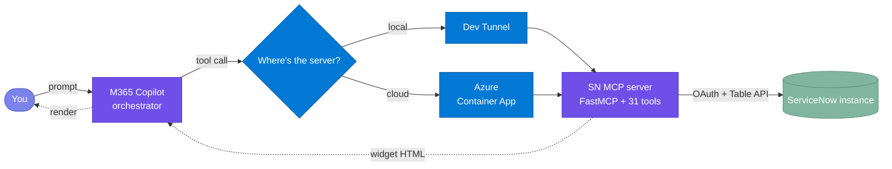

# Ask - ServiceNow

> Drop your ServiceNow instance into Microsoft 365 Copilot. Ask questions in plain English, get back live interactive widgets right inside the chat.

- 🪟 Live widgets render inline in chat
- ✏️ Read / create / update across 5 ITSM/HR entities, plus approvals, knowledge, and catalog
- 🔗 Type names, not sys_ids — agent resolves them on save
- 💻 Local laptop or ☁️ Azure Container Apps
- ⚡ One-command deploy

<p align="center">
  
  
  
  
  
  
  
  
</p>

**Jump to:** [What this is](#1-what-this-is) · [How it works](#2-how-it-works) · [Install](#3-install) · [Troubleshooting](#4-troubleshooting)

---

## 1. What this is

**Ask - ServiceNow** brings your ServiceNow instance straight into Microsoft 365 Copilot. Type something like *"show me open incidents"* or *"resolve INC0010001"* and a **live, interactive widget** renders right inside the chat — **no tab switching, no context loss**. You can read records, create new ones, update what's there, work the approval queue, and search knowledge, all from the Copilot side panel.

🔗 **Name resolution:** lookup fields accept plain names instead of internal IDs. Type *"Beth Anglin"* in an incident's Caller field, and the agent resolves it to the correct person on Save. If multiple matches exist, it shows up to five suggestions so you can pick the right one. The same applies to Assigned To, Requested For, Opened For, and HR Service fields. See [§2 → RESOLVE FK](#resolve-fk--type-names-not-ids) for the full flow.

> [!TIP]
> Works with any ServiceNow instance that exposes the Table API — free PDI, sub-production, or enterprise. HR Case operations additionally require the **HR Service Delivery** plugin (`com.sn_hr_core`).

Two ways to run it:

- 💻 **Local** — your laptop is the backend, exposed via dev tunnel. **Fast iteration** while you tweak.
- ☁️ **Azure** — same code in Azure Container Apps. **Stays online** without your laptop; anyone in your tenant can use it.



---

## 2. How it works

Most interactions map to one of **ten operations**. Here's the quick-reference, followed by each one in action.

### 2.1 Canonical operations

#### 🟢 Design patterns — 8 operations

These follow the **standard three-tool pattern**:

| # | Operation | What you say | What happens | Try it |
|---|---|---|---|---|
| 1 | **GET** | "show me incidents" | Lists the most recent records | *"get all incidents"* |
| 2 | **FILTER** | "open incidents assigned to Joe" | Narrows by state, priority, date, person | *"P1 problems"* · *"changes last 5 days"* |
| 3 | **IDENTIFY** | "show INC0010001" | Fetches that specific record | *"get CHG0000079"* |
| 4 | **EDIT** | "edit INC0010001" | Opens the record with an edit form | *"update problem PRB0040012"* |
| 5 | **CREATE** | "create incident for Beth Anglin, P2" | Pre-filled form — complete and submit | *"new HR case for onboarding"* |
| 8 | **SEARCH** | "search knowledge for VPN setup" | Searches articles or browses catalog | *"browse service catalog"* |
| 9 | **RESOLVE FK** | *(type a name into 🔗 fields)* | Agent matches name → person on Save | *"Beth Anglin"* in Caller field |
| 10 | **CLARIFY** | *(agent asks you)* | Disambiguates before acting | *"Is that an incident or problem?"* |

#### 🔴 Anti-patterns — 2 operations

These require **dedicated tools outside the trio**:

> [!IMPORTANT]
> Anti-pattern operations are difficult to reverse. Once you approve, reject, or resolve from the chat, the state change takes effect immediately in ServiceNow.

| # | Operation | What you say | What happens | Try it |
|---|---|---|---|---|
| 6 | **ACTION** | "resolve INC0010001 as solved remotely" | One-shot state change — done | *"show my pending approvals"* → approve inline |
| 7 | **DRILL** | *(click ▾ on a row)* | Expands child records below | Request → items · Change → tasks |

### 2.2 In action

#### GET — list recent records

Ask for any entity by name. The agent returns the most recent records as a sortable table with priority indicators and per-row ✏️ Edit / ▾ Expand controls.


#### FILTER — narrow the list

Add conditions to your request — state, priority, assignee, date range. The agent figures out which filter to apply from your wording. Lookup fields (like Assigned To) accept names — the agent resolves them to IDs when querying.


#### IDENTIFY — show one record

Every ServiceNow record number carries its type in the prefix (`INC` / `REQ` / `CHG` / `PRB` / `HRC`). Mention a number and the agent routes to the correct entity automatically.

- *"show INC0010001"* → displays that single incident
- *"get CHG0000079"* → displays that single change request


#### EDIT — modify a record

Say *"edit"* followed by a record number and the inline form opens, pre-filled with current values. Change what you need and hit Save.


#### CREATE — open a pre-filled form

The agent picks out values from your sentence — caller, priority, description — and pre-fills the form. You review, complete any remaining fields, and submit.


#### ACTION — one-shot state change

- *"resolve INC0010005"* → opens the resolve form with a close-code picklist
- *"show my pending approvals"* → lists approvals; approve or reject inline from the widget


#### DRILL — expand child records

Requests and Changes have a ▾ expand icon on each row. Click it to see child records inline:

- **Service Request** → request items
- **Change Request** → change tasks


#### SEARCH — knowledge and catalog

- *"search knowledge for VPN setup"* → searches published knowledge articles
- *"browse service catalog"* → lists available catalog items

#### RESOLVE FK — type names, not IDs

Fields marked with 🔗 accept plain names. Type a name, hit Save — the agent resolves it. If there's no exact match, you get up to five suggestions to pick from.

> [!TIP]
> Look for the 🔗 icon on form fields — those are the ones that accept names instead of IDs.


#### CLARIFY — agent asks when ambiguous

If your request could apply to more than one entity type, the agent asks first.

*"show me the network outage from yesterday"* → Agent: *"Is that an incident, request, change request, problem, or HR case?"*


---

## 3. Install

Four steps: clone → configure → run locally → (optional) deploy to Azure. About 30 minutes end-to-end.

### Step 1 — Clone the repo

**Action:**
```powershell
git clone https://github.com/microsoft/mcp-interactiveUI-samples.git
cd mcp-interactiveUI-samples/mcp-apps/servicenow-itsm/python
```

**Validate:** You should see `servicenow_mcp/`, `shared_mcp/`, `widgets/`, `deploy/`, and `agent/` directories.

---

### Step 2 — Get your ServiceNow credentials

You need credentials from your ServiceNow instance. Grab them now — you'll paste them in the appropriate step below.

**For OAuth (recommended):**
1. **Instance hostname** — the first part of your instance URL (e.g. `dev342951` for `https://dev342951.service-now.com`). No `https://` prefix.
2. **OAuth Client ID** — In ServiceNow: System OAuth → Application Registry. Create a new endpoint if needed; the Client ID appears after Save.
3. **OAuth Client Secret** — Same entry, revealed by the Client Secret link. Copy it now; it's masked after page reload.

**For basic auth (development only):**
1. **Instance hostname** — same as above.
2. **Username** — a ServiceNow user with the roles listed below.
3. **Password** — that user's password.

> [!IMPORTANT]
> **OAuth:** Your Application Registry entry must have **grant_type=client_credentials** enabled. Without this, the first token request returns `401 Unauthorized`. PDIs allow it by default; enterprise instances may not.

> [!IMPORTANT]
> **Required ServiceNow roles:** The connecting user (or OAuth client scope) needs read/write access to the tables used by the agent. At minimum: `itil` (Incidents, Requests, Changes, Problems), `sn_hr_core.case_writer` (HR Cases), and `knowledge` (KB search). Enterprise admins may need to grant these explicitly.

> [!TIP]
> Free PDIs hibernate after ~10 days of inactivity. If you see connection timeouts, log in to developer.servicenow.com → Manage → Wake Up Instance.

**Validate:** You have your credentials written down — hostname + OAuth pair (or hostname + username/password).

---

### Step 3 — Run locally

**Prerequisites** (install these first — the script stops immediately if any are missing):

- 🐍 **Python ≥ 3.11**
- 📦 **Node.js ≥ 18**
- 🌐 **[Dev Tunnels CLI](https://learn.microsoft.com/azure/developer/dev-tunnels/get-started)** — run `devtunnel user login` once
- 🛠️ **[M365 Agents Toolkit](https://aka.ms/teamsfx)** (VS Code extension)
- 🏢 **M365 dev tenant** with **Custom App Upload Enabled ✓** and **Copilot Access Enabled ✓**

**Action:** Copy `.env.example` to `.env` in the project root, then fill in your credentials:

| Param | Value |
|---|---|
| `SERVICENOW_INSTANCE` | Your instance hostname (e.g. `dev342951`) |
| `SERVICENOW_AUTH_MODE` | `oauth` (recommended) or `basic` |
| `SERVICENOW_CLIENT_ID` | OAuth Client ID *(oauth mode)* |
| `SERVICENOW_CLIENT_SECRET` | OAuth Client Secret *(oauth mode)* |
| `SERVICENOW_USERNAME` | ServiceNow username *(basic mode only)* |
| `SERVICENOW_PASSWORD` | ServiceNow password *(basic mode only)* |

Then run:
```powershell
.\deploy\LocalDeploy.ps1
```

The script takes 3–4 minutes the first time:
1. 🐍 Python venv + dependencies (~60s)
2. ⚛️ React widget bundle (~45s)
3. 🚀 MCP server on `:8081` (~3s)
4. 🌐 Dev tunnel with public HTTPS URL (~5s)
5. ✅ Manifests rebuild + validate (~5s)
6. 📤 Agent package uploads to M365 (~15s, device-code sign-in first time)

**Validate:**
1. The terminal shows the LIVE banner:
```text
  =====================================
   ENTERPRISE SERVICENOW COPILOT LIVE
  =====================================
  Server  -->  http://localhost:8081
  Tunnel  -->  https://<id>-8081.inc1.devtunnels.ms
  MOS3    -->  agent package live in M365 Copilot
```
2. Run `curl -X POST http://localhost:8081/mcp -H "Content-Type: application/json" -d '{"jsonrpc":"2.0","method":"initialize","id":1}'` — you should get a JSON-RPC response.
3. Open M365 Copilot → pick **Ask - ServiceNow** from the agent picker.
4. Try *"show me open incidents"* — a widget should render with an incident list.

> [!TIP]
> If the agent doesn't appear in the picker, wait 1–2 minutes and refresh. Still missing? Jump to [§4 Troubleshooting](#4-troubleshooting).

---

### Step 4 — Deploy to Azure (optional)

Moves the server off your laptop. The agent stays online without your machine, and anyone in your tenant can use it.

**Prerequisites:**
- ☁️ **Azure CLI ≥ 2.50** — sign in with `az login`
- 💳 **Azure subscription** with Contributor permissions

**Action:** Copy `deploy/parameters.example.bicepparam` to `deploy/parameters.bicepparam` and fill in your credentials:

| Param | Value |
|---|---|
| `servicenowInstance` | Instance hostname |
| `servicenowAuthMode` | `oauth` or `basic` |
| `servicenowClientId` | OAuth Client ID *(oauth mode)* |
| `servicenowClientSecret` | OAuth Client Secret *(oauth mode)* |
| `servicenowUsername` | ServiceNow username *(basic mode only)* |
| `servicenowPassword` | ServiceNow password *(basic mode only)* |
| `acrName` | Globally unique, lowercase alphanumeric, 5–50 chars |
| `location` | Azure region (e.g. `eastus`, `westeurope`) |

Then run:
```powershell
.\deploy\ServerDeploy.ps1
```

First run provisions: Resource Group, Container Registry, Container Apps Environment, Container App, Log Analytics, Managed Identity. Takes 5–10 minutes.

> [!NOTE]
> **Response speed depends on your Azure Container Apps plan.** The default Consumption plan cold-starts containers on each request after idle timeout (~5–15 s first response). For production or demo use, consider a **Dedicated plan** or set `minReplicas: 1` in your container app config to keep the container warm.

**Validate:**
1. The script prints a public Azure FQDN. Test it:
```powershell
curl -X POST <FQDN>/mcp -H "Content-Type: application/json" -d '{"jsonrpc":"2.0","method":"initialize","id":1}'
```
You should get a JSON-RPC response (not a connection error).
2. Verify the container image: `az containerapp show -g <rg> -n <app> --query "properties.template.containers[0].image" -o tsv` — should return your ACR image.

**Next:** Re-upload the agent package pointing to the cloud endpoint:
```powershell
.\deploy\ServerDeploy.ps1 -UploadAgentOnly
```

> [!TIP]
> If your deploy script doesn't support `-UploadAgentOnly`, update the `MCP_GATEWAY_URL` in your agent manifest to the ACA FQDN and re-upload via M365 Agents Toolkit.

> [!NOTE]
> To tear down later: `.\deploy\ServerDestroy.ps1` removes the provisioned resources but leaves your resource group and M365 agent registration intact.

---

#### Suggested sample data

The agent works best when your ServiceNow instance has records to interact with. If you're on a fresh instance, seed this minimum:

- **3–5 Incidents** with mixed states (New, In Progress, Resolved) and priorities (P1–P4), assigned to different people
- **2–3 Requests or Changes** with at least one child record (request item or change task) to exercise DRILL
- **2–3 Knowledge articles** with searchable keywords (e.g. "VPN", "password reset")
- **3+ distinct Users** in sys_user for name lookups and fuzzy matching

> [!TIP]
> Free PDIs from [developer.servicenow.com](https://developer.servicenow.com) include ~50 incidents, ~10 changes, KB articles, and demo users out of the box. You can start immediately without seeding.

---

## 4. Troubleshooting

If you hit an issue, find it below — organized by symptom.

### Agent & Copilot

- **Agent missing from the picker** → Wait 1–2 minutes after upload, then refresh. Still missing? Check that Custom App Upload is enabled in ATK → Accounts.
- **"Oops! Something went wrong"** → Dev tunnel dropped momentarily. Wait 5–10 seconds and re-send your message.
- **Widget doesn't render on mobile** → Widgets render best on desktop/web. Mobile layouts are tighter but functional.

### ServiceNow connection

- **`401 Unauthorized` on first call** → Your OAuth Application Registry entry doesn't allow `client_credentials`. Enable it in System OAuth → Application Registry → your entry.
- **Persistent `connection timeout`** → Your PDI has hibernated (~10 days idle). Wake it at developer.servicenow.com → Manage → Wake Up Instance.
- **HR Case queries return empty** → Your instance doesn't have the HR Service Delivery plugin (`com.sn_hr_core`). Install from System Definition → Plugins.

### MCP server & Azure

- **`/mcp` returns 421 "Invalid Host header"** → DNS rebinding protection is blocking the Azure hostname. This is already disabled in the current codebase; if you're on an older version, set `transport_security=TransportSecuritySettings(enable_dns_rebinding_protection=False)` in `servicenow_server.py`.
- **`/mcp` returns 502 or connection refused** → Container failed to start. Check logs: `az containerapp logs show -g <rg> -n <app> --tail 100`. Most common cause: wrong credentials in `parameters.bicepparam`.
- **`RegistryNameInUse` during deploy** → ACR names are globally unique. Pick a different `acrName` (append random digits).
- **`InvalidResourceGroupLocation`** → Resource group exists in a different region. Pass `-Location <existing-region>` or use a fresh resource group.

### Manifests & upload

- **`regen_manifests.py` says "drift detected"** → Manifests are out of sync with the server URL. Re-run your deploy script to rebuild them, ensuring the correct `MCP_GATEWAY_URL` is set.
- **MOS3 upload fails with `403`** → Token expired. Delete `.mos3_token_cache.json` and re-run (device-code sign-in will prompt again).
- **`TooLongInstructions` rejection** → `agent/appPackage/instruction.txt` exceeds 8000 chars. Trim it.
- **Tools show dev-tunnel URL after Azure deploy** → Re-run `.\deploy\LocalDeploy.ps1 -SkipServer -SkipTunnel` so the Azure URL is preserved.

### Common questions

- **Can I run without Azure?** → Yes. Fill `.env`, run `LocalDeploy.ps1`. Dev tunnel handles the rest. Step 4 is optional.
- **How do I add a new entity?** → Add to `_ENTITY_TABLES`, create three handler functions (`get`/`create`/`update`), register in `TOOL_SPECS`, re-run deploy. Manifests auto-sync.
- **Is this production-ready?** → It's a reference implementation for demos and pilots. For production: move secrets to Key Vault, switch to per-user OAuth, add audit logging and rate limiting, pin image tags.
